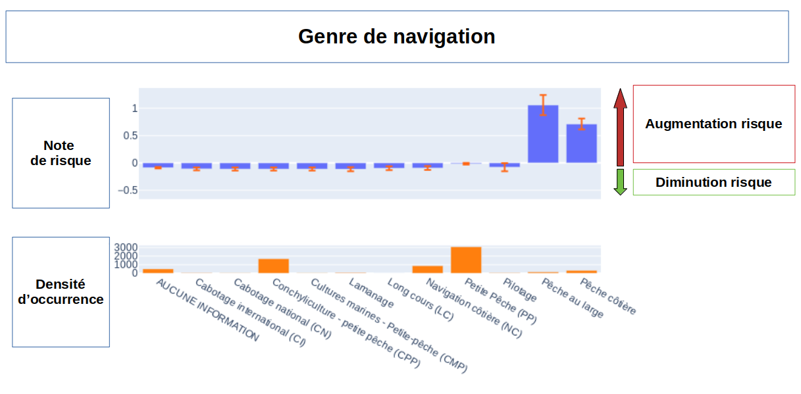
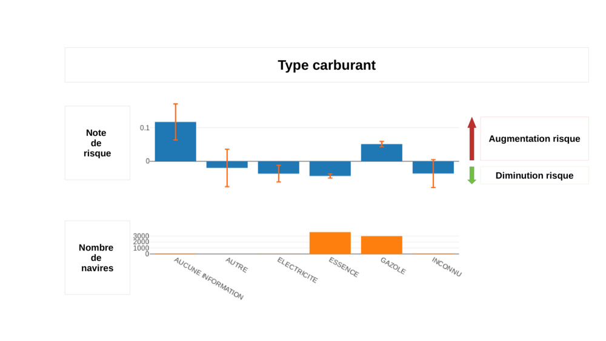
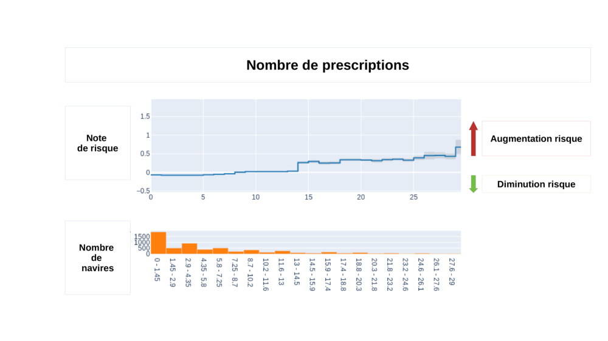
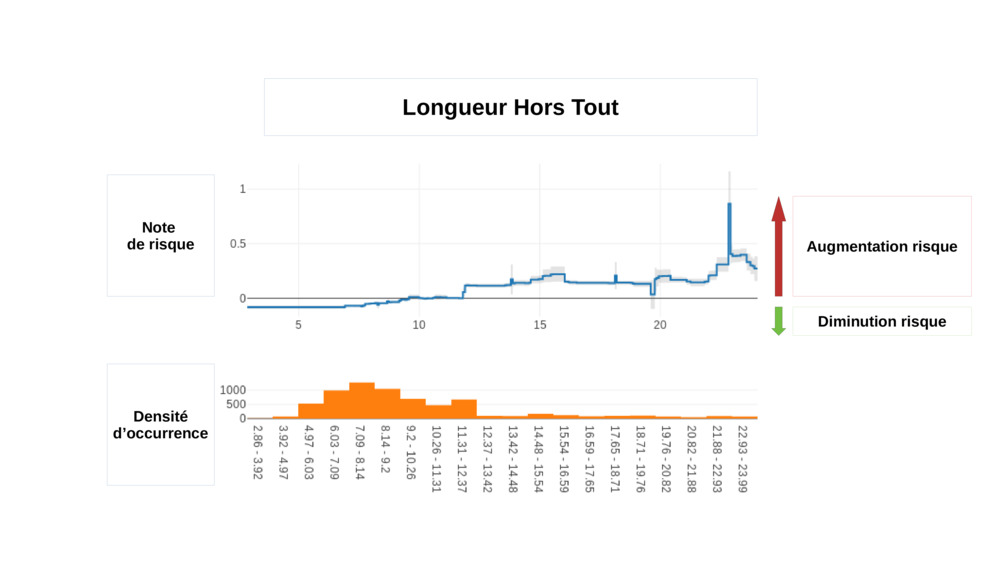
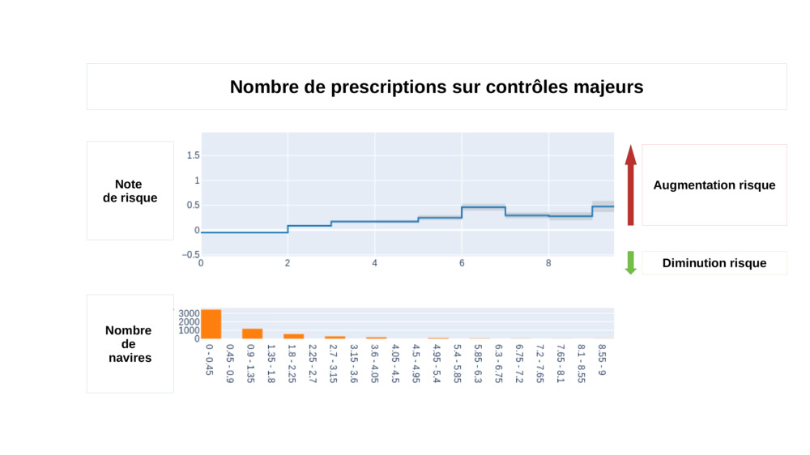
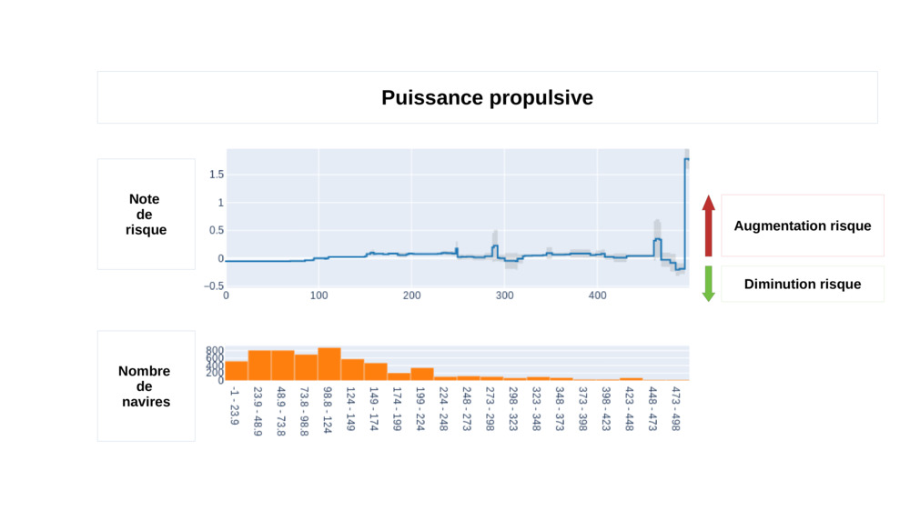
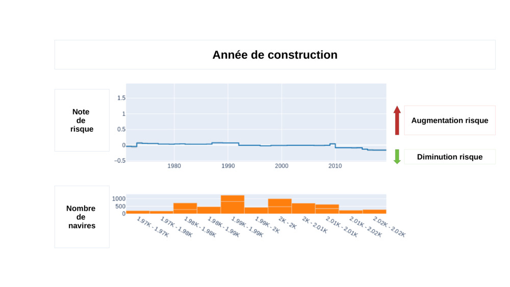

# 3. Analyse Sécurité Navires
Les anlayses présentés ci-dessous décrivent la corrélation entre chaque paramètre et l'[indicateur d'accidentologie](./accidentologie.md#). Elles contiennent un graphique généré par l'[algorithme](./fonctionnement_analyse.md#) et notre intérprétation de ces graphiques.  

## Liste des paramètres retenus
Ce tableau liste tous les paramètres, **triés par ordre d'importance** selon les résultats de notre algorithme (du plus important, au moins important).
Plus bas, vous trouverez les analyses détaillées pour chacun de ces paramètres.

| Paramètre	| Description |	Données |  Exemple |
| -------- | -------- | -------- | -------- | -------- | 
| [Genre de navigation](./analyse_securite.md#genre-de-navigation) |  Donnée permettant de réguler le nombre de marins a bord | Gens de Mer | Pêche Hauturière |
| [Type de carburant](./analyse_securite.md#type-de-carburant) |  Type de carburant | Navire | Diesel |
| [Prescriptions sur les contrôles](./analyse_securite.md#prescriptions-sur-tous-les-controles) | Somme des prescriptions sur tous les contrôles pour chaque navire sur les 5 dernières années | Contrôles | 23 |
| [Longueur](./analyse_securite.md#longueur) |  Longueur hors-tout du navire | Navire | 12.0 |
| [Prescriptions sur les contrôles majeurs](./analyse_securite.md#prescriptions-sur-les-controles-majeurs) |  Somme des prescriptions sur contrôles majeurs pour chaque navire sur les 5 dernières années | Contrôles | 4 |
| [Puissance Propulsive](./analyse_securite.md#puissance-propulsive) |  Puissance propulsive du moteur en kW | Navire | 750 |
| [Année de construction](./analyse_securite.md#annee-de-construction) |  Année de construction du navire | Navire | 2003 |

*Ce tableau présente les paramètres tels que utilisés dans CibNav V0.1. Il pourra évoluer au cours du temps. Vous pouvez consulter toutes [les modifications](./evolution_cibnav_v2.md)*

Nous avons également étudié d'autres paramètres qui n'ont pas été utilisés car ils présentaient trop peu de corrélation avec l'accidentologie. Vous pouvez retrouvez [la liste des paramètres non retenus](./parametres_non_retenus.md#).

Vous pouvez également retrouver la [liste des paramètres](./parametres_en_cours_analyse.md#) qui sont inscrits dans notre feuille de route et qui seront prochainement analysés. 

## Analyses détaillées des paramètres retenus, par ordre d'importance

### Genre de navigation

Cette donnée (initialement GM) réglemente le temps de de navigation. Elle donne beaucoup d'informations sur les navires catégorisés en 'Pêche au large' et 'Pêche côtière'. Ces deux catégories ont un indicateur de risque très important.  

### Carburant

Le type de carburant permet facilement de séparer notre flotte en deux types, avec un  impact aggravant pour les moteurs au 'gazole' et un  impact bénéfique pour les moteurs à 'essence'. 

### Prescriptions sur les contrôles

Nous observons une forte corrélation entre le nombre de prescriptions et l'accidentologie. L'impact sur l'accidentologie augmente linéairement en fonction du nombre de prescriptions.

Les prescriptions sur contrôles majeurs ne sont pas prises en compte car elles apparaissent déjà dans un autre [paramètre](./analyse_securite.md#prescriptions_sur_les_controles_majeurs) 
### Longueur

Les quelques navires de plus de 12 mètres de la flottille sont beaucoup plus accidentogènes. Voici quelques explications possibles :
- Plus de marins à bord implique plus de risques de blessés ou malades **quoi faire ?**
- Biais caché ** lien vers étude**

### Prescriptions sur les contrôles majeurs

De la même façon que pour les prescriptions, il y a une forte corrélation avec l'accidentologie.

### Puissance propulsive

### Année de construction

L'accidentologie de la flotte CibNav est assez peu affectée par l'année de construction des navires. Nous observons une accidentologie plus faible pour les navires construits après 2008, mais cette variation est beaucoup plus faible que l'idée reçue. 

