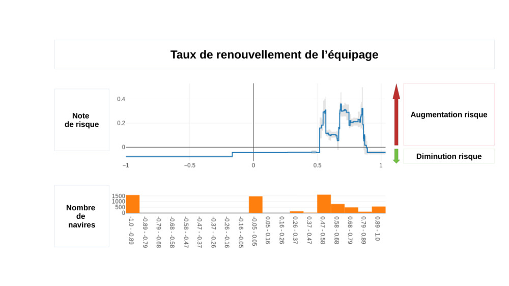

# Liste des paramètres à analyser

| Paramètre	| Description |	Données |  Exemple |
| -------- | -------- | -------- | -------- |  -------- | 
| [Taux de renouvellement de l'équipage](./analyse_securite.md#turn-over-equipage) **(en cours)** | Calcul du taux de renouvellement du personnel | Embarquements | 56% |
| Remotorisation  | Durée depuis laquelle la dernière motorisation ou re-motorisation a été effectuée sur le navire | Navire | 4 (ans) |
| Mutation de propriétés | Nombre de mutations de propriétés | Navire | 3 |

### Taux de renouvellement de l'équipage
::: warning En Cours de Construction
Cette analyse est en cours.
:::

